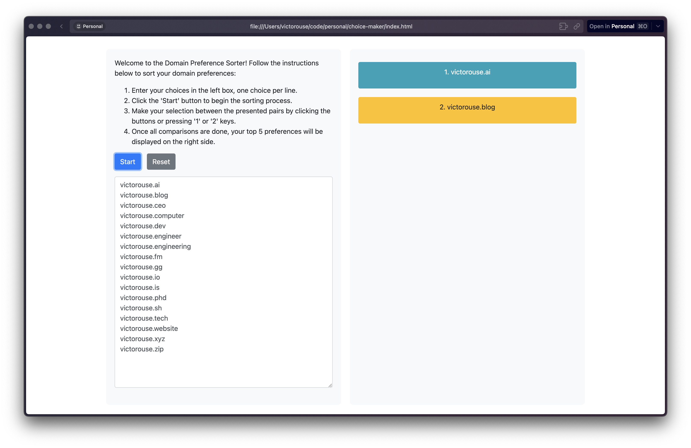
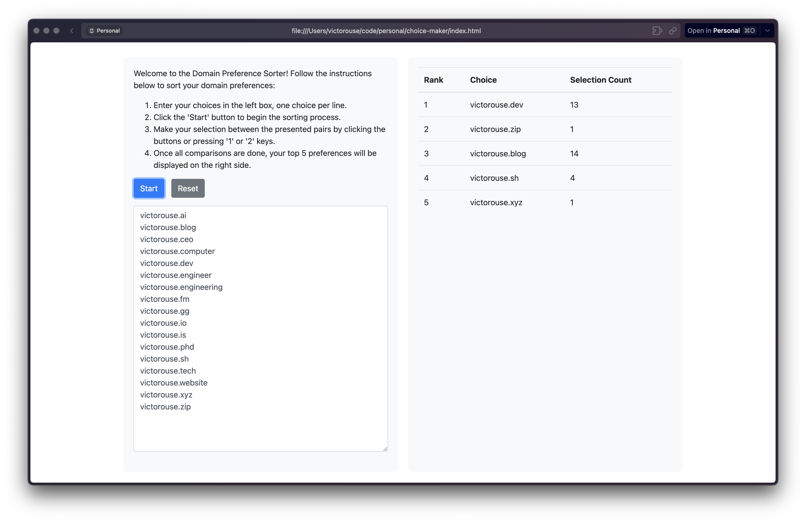

# Choice Maker

A web-based tool to interactively sort and rank a list of domain names or any other choices based on user preference. The tool is mobile responsive and uses Bootstrap for styling. The user can input their choices, compare them interactively, and the tool will display the top 5 preferred choices at the end.

I was trying to choose a domain name for my [website](https://victorouse.github.io) and had this idea.

https://chat.openai.com/share/18e318c9-01bf-483c-b2ab-2a6813ce1417

## How to Use

1. **Enter Choices:** Users can input their domain names or other choices in the provided textarea, one choice per line.
2. **Start Sorting:** Click the 'Start' button to begin the sorting process.
3. **Make Selections:** Users will be presented with pairs of choices. Make a selection between the presented pairs by clicking the buttons or pressing the '1' or '2' keys on the keyboard.
4. **View Results:** Once all comparisons are done, the top 5 preferences will be displayed on the right side of the screen.

## Features

- **Mobile Responsive:** Works well on a variety of devices and window or screen sizes.
- **Interactive Comparisons:** Users can compare their choices interactively and rank them based on their preferences.
- **Quick Sorting:** Uses a comparison-based sorting algorithm to quickly rank user preferences.

## Technologies Used

- **HTML:** Structures the web content.
- **CSS & Bootstrap:** Styles the web content and ensures mobile responsiveness.
- **JavaScript:** Provides interactivity to the web content.

## Credits

This project was created by ChatGPT from OpenAI.
